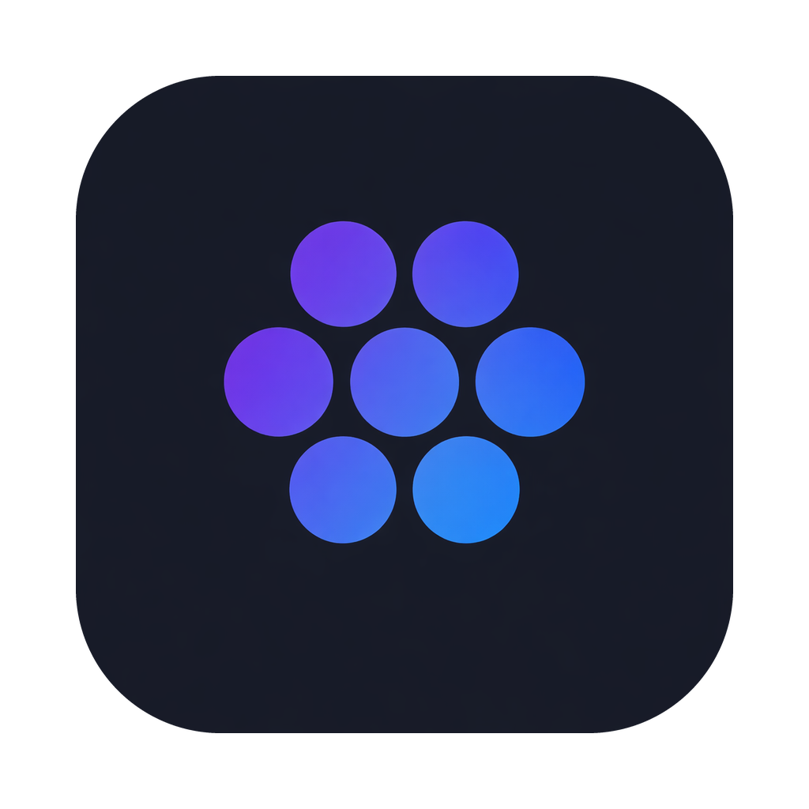
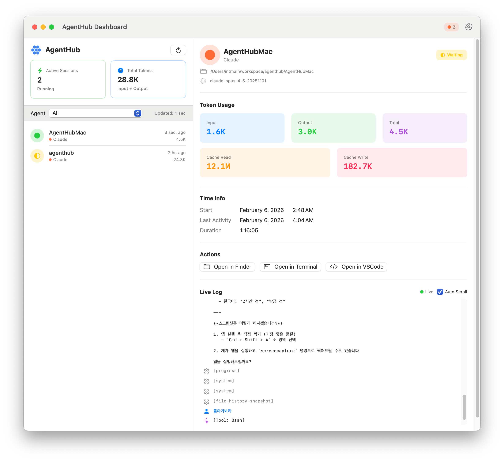

# AgentHub

<p align="center">
  
</p>

<p align="center">
  <strong>The United Nations for Your AI Coding Agents</strong>
</p>

---

## Preface

***In the manner of the Hunminjeongeum Haerye (1446):***

The tokens of our AI agents, being scattered across different terminal windows, do not communicate with one another.

Thus, even when a diligent developer wishes to know "how broke am I today?", they cannot easily grasp the full picture. They must wander through `~/.claude`, peek into `~/.codex`, and spelunk through `~/.gemini` like a digital archaeologist.

Feeling great compassion for this plight, I have created this humble application.

So that developers everywhere may monitor their agents with ease, track their spending without tears, and perhaps finally explain to their finance team why the cloud bill looks like a phone number.

*This is my wish.*

---

## What Is This Sorcery?

AgentHub is a **macOS menu bar app** that watches over your AI coding agents like a helicopter parent, but in a good way.

It monitors:
- **Claude Code** (the philosopher)
- **Codex CLI** (the OpenAI one)
- **Gemini CLI** (the Google one)

All in one place. No more terminal window archaeology.

---

## Installation

### The Civilized Way (Homebrew)

```bash
brew tap intmain/agenthub
brew install --cask agenthub
```

Or if you're feeling fancy, one-liner style:

```bash
brew install intmain/agenthub/agenthub
```

### The Manual Way (For the Brave)

1. Download `AgentHub-1.0.0.dmg` from [Releases](https://github.com/intmain/AgentHub/releases)
2. Open the DMG
3. Drag AgentHub to Applications
4. Pretend you knew how to do this all along

---

## Features

| Feature | Description |
|---------|-------------|
| **Menu Bar** | Lives in your menu bar. Judges your token spending silently. |
| **Dashboard** | A beautiful window showing all your agents. Great for feeling productive. |
| **Cost Tracking** | Calculates how much money your AI friends are eating. *It's a lot.* |
| **Widgets** | Desktop widgets for those who like to see their spending at all times. Masochists. |
| **Auto-refresh** | Uses FSEvents to watch log files. It never sleeps. *Neither should you.* |

---

## Supported Agents

| Agent | Log Path | Price (Input/Output per 1M tokens) |
|-------|----------|-----------------------------------|
| Claude Code | `~/.claude/projects/` | $3 / $15 (expensive but worth it) |
| Codex CLI | `~/.codex/sessions/` | $2.5 / $10 (the middle child) |
| Gemini CLI | `~/.gemini/tmp/<projectHash>/chats/session-*.json` | $0.1 / $0.4 (budget-friendly king) |

> **Note:** Gemini CLI parsing now follows the actual storage structure above and maps active sessions to running project working directories.

---

## Screenshot

<p align="center">
  
</p>

*"Is that... is that how much I spent today?"*

---

## Requirements

- macOS 14.0 (Sonoma) or later
- A developer account balance you're willing to sacrifice
- Emotional readiness to see your token usage

---

## Building from Source

For the curious souls who trust no one:

```bash
git clone https://github.com/intmain/AgentHub.git
cd AgentHub
open AgentHub.xcodeproj
```

Then hit ⌘+R and pray.

---

## Project Structure

```
AgentHub/
├── AgentHub/           # The menu bar app (the face)
├── AgentHubCore/       # Shared logic (the brain)
├── AgentHubWidget/     # WidgetKit widgets (the tiny face)
└── AgentHubCli/        # CLI tool (for terminal purists)
```

---

## License

MIT License

*Use it, modify it, ship it, just don't blame me when you see your token bill.*

---

## Contributing

Found a bug? Want a feature?

1. Open an issue
2. Submit a PR
3. Or just silently judge my code. That's fine too.

---

<p align="center">
  Made with ☕ and existential dread about API costs
</p>
